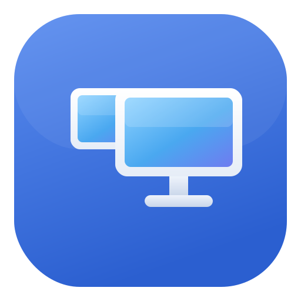
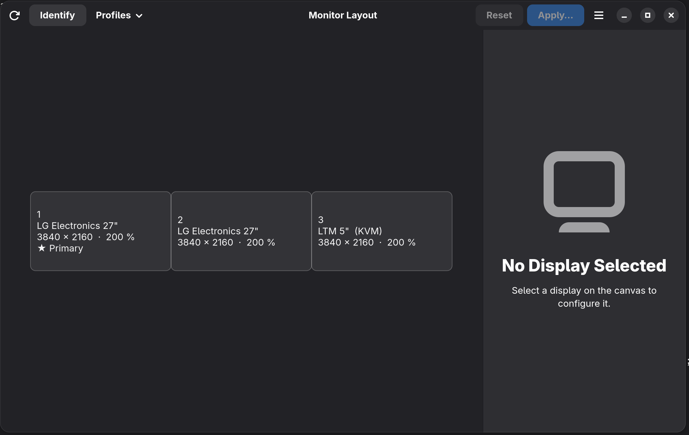

# Monitor Layout

A native GNOME (Wayland) display layout manager with **partial mirroring** —
built for setups where a KVM-over-IP console should mirror the main monitor
while a second monitor stays extended.



*The canvas showing a mirror group: the KVM and the main LG panel as separate
screens inside one “⧉ Mirrored” container, with the second LG extended beside
it and the group's shared settings in the sidebar.*

Monitor Layout talks directly to Mutter's `org.gnome.Mutter.DisplayConfig`
D-Bus interface — the same mechanism GNOME Settings uses — and adds what the
built-in Displays panel cannot do: mirror *any subset* of displays while the
rest remain independent.

## Features

* **Visual layout editor** — drag monitor-shaped cards with edge snapping,
  alignment guides, automatic gap/overlap repair, and keyboard nudging
  (arrow keys / Shift+arrows). Live validation explains anything Mutter
  would reject before you ever apply.
* **Partial mirroring** — select a display, choose *Mirror With*, and the
  two become one mirror group, drawn as separate screens inside one group
  container; place the group left/right/above/below the remaining display,
  on any side. Mirror resolutions are computed from the real common mode
  list (mixed refresh rates supported — e.g. an LG panel at 59.997 Hz
  cloned with a KVM at 30 Hz). Mirror edits are transactional: they either
  produce a fully valid layout or change nothing.
* **Per-display settings** — resolution (with aspect-ratio labels), refresh
  rate (VRR modes included), scaling incl. fractional, orientation, enable/
  disable, primary display. Only values the compositor actually advertises
  are offered.
* **Identify** — numbered overlays on every screen. GNOME Shell's official
  monitor labels are used where permitted; since Shell restricts that API
  to GNOME Settings, a built-in fallback shows a brief full-screen number
  card per monitor instead. Numbers match the canvas (1 = leftmost).
* **Profiles** — save named layouts (`KVM + Main Mirrored`, `Local Dual`,
  …). Profiles match monitors by **EDID identity** (vendor/product/serial),
  not connector names — they survive cable/port swaps; ambiguous or partial
  matches are reported, never guessed.
* **KVM aware** — capture/KVM devices are auto-detected (heuristic,
  overridable) and labeled; every monitor can get a friendly name.
* **Safe by construction** — see below.

## Safety model

* Applying uses GNOME's own confirmation: Mutter arms a compositor-side
  20-second revert timer and GNOME Shell asks *"Keep these display
  settings?"*. Nothing touches `monitors.xml` until you confirm — even an
  application crash cannot make a bad layout permanent.
* *Try for 30 s* previews apply temporarily with an in-app countdown **and**
  an out-of-process watchdog (`monitor-layout-revert-helper`) that restores
  the previous configuration if the app crashes or hangs.
* Every apply is preceded by Mutter's verify mode; nothing invalid is ever
  sent. Details: `docs/safety-and-rollback.md`.

## Supported systems

Fedora 44 / GNOME 50.x on Wayland is the tested target (developed and
verified against Mutter 50.2). Mutter 49+ should behave identically
(identical D-Bus interface); older versions are untested. X11 sessions and
non-GNOME compositors are not supported.

## Installation

### RPM (recommended)

```bash
sudo dnf install rpmdevtools rust cargo gtk4-devel libadwaita-devel \
                 desktop-file-utils libappstream-glib
./packaging/build-rpm.sh
sudo dnf install target/rpmbuild/RPMS/x86_64/monitor-layout-*.rpm
```

Uninstall with `sudo dnf remove monitor-layout`. User data lives in
`~/.config/monitor-layout/` (profiles, preferences) and
`~/.local/state/monitor-layout/` (rollback markers); remove those
directories to fully clean up.

No special permissions are needed: `org.gnome.Mutter.DisplayConfig` is an
unrestricted session-bus interface, and the app never runs as root.
(A Flatpak would need `--talk-name=org.gnome.Mutter.DisplayConfig` and
`--talk-name=org.gnome.Shell`; no manifest is shipped because a sandboxed
build has not been tested.)

### From source

```bash
sudo dnf install rust cargo gtk4-devel libadwaita-devel
cargo build --release
./target/release/monitor-layout
```

Binaries: `monitor-layout` (the app), `monitor-layout-ctl` (diagnostics
CLI), `monitor-layout-revert-helper` (watchdog; must be installed next to
the app binary or on `PATH` for previews).

## Usage

1. **Identify screens**: focus the window (or press *Identify*) — numbered
   overlays appear on the physical screens matching the canvas cards.
2. **Arrange**: drag cards; they snap to edges and settle without gaps or
   overlaps (Mutter requires adjacency). Arrow keys move the selected card.
3. **Mirror two screens, keep one extended**: click the display to keep as
   anchor → sidebar → *Mirror With* → choose the second display. The group
   card (⧉ Mirrored) can be dragged to either side of, above, or below the
   independent display. *Remove from mirror group* splits it again.
4. **Pick the primary**: select a card → toggle *Primary Display* (exactly
   one logical display is primary — the mirror group can be primary, or the
   independent one).
5. **Apply**: press *Apply…*. Screens may blink; confirm *Keep Changes* in
   the system dialog within 20 s or everything reverts. *Try for 30 s*
   previews the layout temporarily instead.
6. **Profiles**: *Profiles → Save Layout as Profile…* stores the current
   editor layout; loading a profile puts it in the editor for review —
   applying stays explicit.

### Troubleshooting

* `monitor-layout-ctl state` — human-readable dump of what Mutter reports;
  `--json` for machine-readable, `diagnostics` for a sanitized report.
* `monitor-layout-ctl watch` — live log of monitor change events.
* Run the app with `RUST_LOG=info` for structured logs on stderr.
* If a preview ended in a crash, the previous configuration is restored by
  the watchdog; logging out and back in always restores the last confirmed
  configuration (temporary changes are never persisted).
* The banner at the top explains why a layout can't be applied (gaps,
  mixed mirror resolutions, unsupported scale, …).

## Known limitations

GNOME Shell on some hardware (including the reference machine: AMD Strix
iGPU + Lontium HDMI-KVM) can crash during mode-sets — a platform bug that
no D-Bus client can prevent; the safety model ensures nothing is lost. HDR
color modes and RGB range are shown read-only in v0.1. Full list:
`docs/known-limitations.md`.

## Documentation

| Document | Contents |
|---|---|
| `docs/system-audit.md` | The audited reference system (hardware, versions, live probes) |
| `docs/research-and-feasibility.md` | Why this API, verified feasibility, compatibility strategy |
| `docs/mutter-dbus-notes.md` | Verified `org.gnome.Mutter.DisplayConfig` reference (Mutter 50.2) |
| `docs/architecture.md` | Crate/workspace design |
| `docs/safety-and-rollback.md` | The apply/preview/rollback machinery |
| `docs/testing.md` | Automated suite (92 tests) + manual matrix |
| `docs/known-limitations.md` | Honest list of what doesn't work (yet) |

## Source

Development happens at
[github.com/christosdaggas/Gnome-Monitors](https://github.com/christosdaggas/Gnome-Monitors).
CI (GitHub Actions) runs formatting, Clippy with denied warnings, the full
test suite, release build, desktop/AppStream validation, and an RPM
build + smoke install on Fedora 44.

## License

GPL-3.0-or-later (see `LICENSE`). © Christos A. Daggas.
The application icon originates from SVG Repo; verify the individual
icon's license terms before redistribution.
